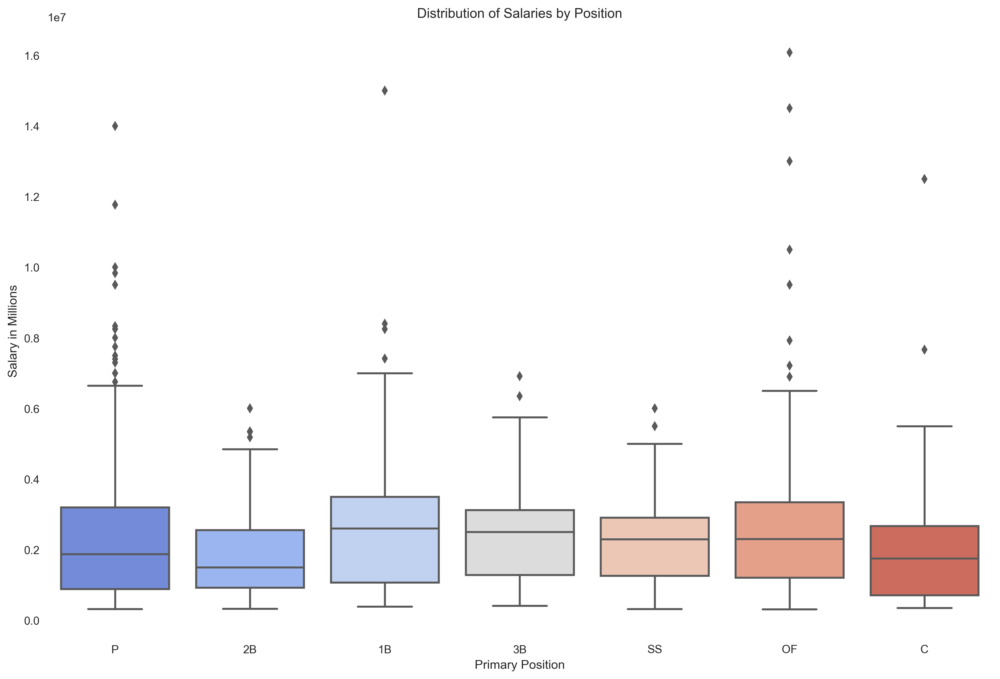

# Linear Regression Model: Predicting Baseball Player's Salaries After Arbitration
### Mod 2 Project by Paul Torres

This repository contains data collection, cleaning and analyses of the salary, batting statistics, awards, and all-star selections of MLB players that started their rookie season after 2000. It includes all those that played until the end of the 2019 season. 

# Project

For this project, I aim to build a linear regression model that will be able to interpret the decisions behind the salary outcomes for rookie players after their rookie arbitrations. The goal being a model that could determine a team's strategy. Further application could be used for free agency signings when bidding against other teams. I started off with a number of ideas about the performance features that would have the most correlation with salary and used that as a baseline to guide EDA. Since the game of baseball has changed tremendously over its history, only recent players were taken into consideration.

# Structure of Repository
- PNG -- contains images linked in README
- helper.py -- contains helper functions to assist in the cleanup of the data
- 01_data_cleaning.ipynb -- contains the preprocessing of the data. Combining the different data frames and gathering the three year statistics and the fourth year salary.
- 02_analysis.ipynb -- contains the exploration of the data set and the statistical tests for the features
- 03_modeling.ipynb -- contains different models to find the best indicators of salary for pitchers and batters separately
- README.md

# Approach
1. *Understanding the data*
	- What effect has the change in baseball strategy had on the types of players they value?
		1. **The change from long ball to money ball**:  
		> "Chicks may dig the long ball, but is relying on it to produce runs a viable strategy for teams with World Series aspirations?"
		2. **Establishing a negotiation plan**:  
		Presenting a case to arbitration that could convince the panel to agree with arbitration offer.

# Data
Before we dive deeper into the questions, here is some information on our data. 
1. Only players whose rookie season occurred on 2000 or later were included.
2. Data used in this repository is available SeanLahman.com. 
3. Players who did not play more than 3 seasons were excluded. 

# Process
With negotiations in mind, I explored the data and answered some of the questions below.

## Is there a difference by side of the plate in terms of salary and prevalence?
Left handed batters vs Right Handed Batters

The difference in prevalence.

The difference in mean salary.

## Does position come into play when determining salary?

## Is it money ball or long ball?
What statistics matter when entering arbitration?

# Preprocessing 

## Working to isolate pre-arbitration seasons

Each rookie's statistics had to be compiled for their first three years. After that year they would be eligible for arbitration. Combining that data with their salary in their fourth year, the project was to see if their was a reliable predictor into the amount of money players would earn in their fourth year. 

# Modeling & Results

## Separation by Position

After the initial exploration of the data, I split up the data between pitchers and batters. I did this because the statistics of a pitcher would just add confusion to the model for a batter and vice versa. 

## Batters

Batters were grouped together regardless of position. Several models were run including Linear Regression, Lasso Cross Validation, and XGBoost. 

The final model scores were:

|Model Name|Training Set R2 Score|Testing Set R2 Score|
|-|-|-|
|Linear Regression|0.435|0.307|
|Lasso|0.418|0.404|
|Gradient Boosting Regressor|0.972|0.273|
|***Lasso CV***|0.406|0.410|

As you can see, the Gradient Boosting Model was terribly over fit. This is a common problem with boosting models as their sequential nature leads to adjusting on the training data. 

The best and most consistent score was the Lasso CV model. Lasso is a great tool for feature selection as it pushed coefficients of features with less importance to zero. 

**Winner**: Lasso CV with a R2 score of 41%.

When we take a look at the coefficients that the Lasso CV model had left. We see the importance of certain features.

If we look closely at the above graph, we can see the most important positive and negative impacts on a players salary during arbitration. And being an award winner in your first three years seems to have the highest positive impact on a rookie's salary. Followed not so closely by hits and home runs. 

On the negative side, sacrifice hits is the worst. This leaves a lot to the analysis. It could be that the increase in sacrifice hits means that less time is spent on base or gaining extra bases. Sacrifice hits also lead to a definitive out even if it moves a runner over or to a score. 

## Pitchers

Pitchers were next. And while the pitcher position is varied greatly from starters, relievers and closers, the sample size was too small to differentiate them. The same models were tried on the pitchers subset. 

The final model scores were:

|Model Name|Training Set R2 Score|Testing Set R2 Score|
|-|-|-|
|***Linear Regression***|0.412|0.368|
|Lasso|0.262|0.251|
|Gradient Boosting Regressor|0.980|0.201|
|Lasso CV|0.380|0.333|

As you can see, the Gradient Boosting Model was terribly over fit again.

The best and most consistent score was the Linear Regression model. It does not have the feature selection aspect the way Lasso does but it did produce the most reliable and high score for the subset of data. 

**Winner**: Linear Regression with a R2 score of 37%.

When we take a look at the coefficients that the Linear Regression model had left. We see the importance of certain features.

Since this model does not have feature selection, there are more coefficients to analyze. On the positive side, leading by a wide margin is BFP – which stands for Batters Faced by Pitcher. This is easy to understand if you think about the game of baseball. 

While strikeouts and walks are documented milestones, simply getting an out is the key. Facing more batters means that not only is the pitcher in the game longer but also is not giving up runs so that the manager has to take him out. 

On the negative end, the increase inn innings pitched seems to negatively affect their salary. This will take critical thinking about the effects more innings has on a pitcher's stamina and future longevity. 

# Conclusion

From our data, it seems we are missing vital information on the players. One handicap we have is the relative new philosophy that is money ball. Since this is a recent phenomenon, there isn't a large pool of players to pull from.

Based on the data used, for batters, recognition and hits were the biggest categories for increased salary while sacrifice hits was the biggest category for decreases. 

For pitchers, batters faced vs innings pitched were the best and worst features respectively. 

# Further Steps

My next steps for this project would be to include the python package *pybaseball* which has a much more comprehensive statistics set. 