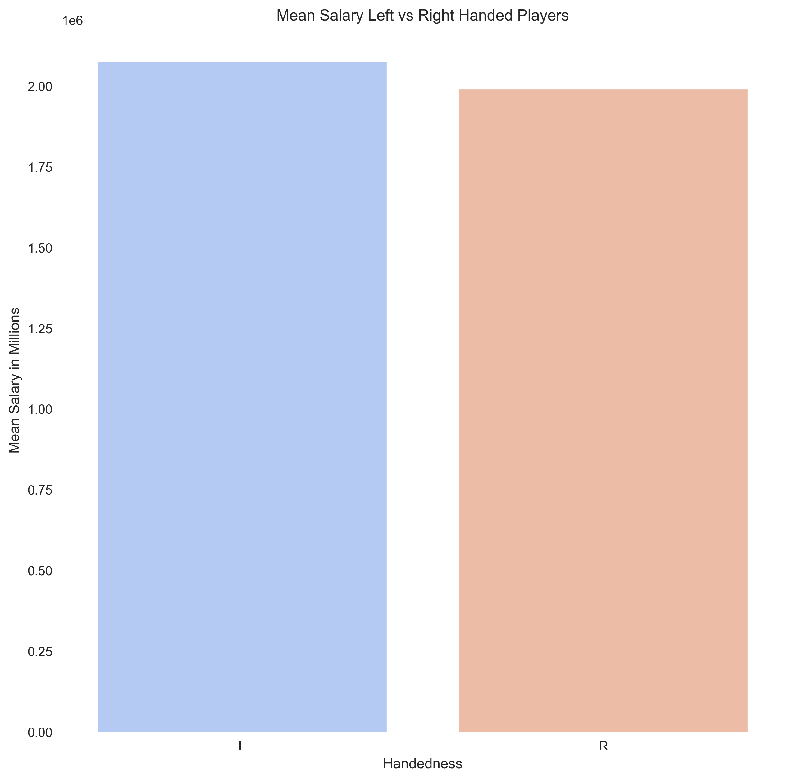

# Linear Regression Model: Predicting Baseball Player's Salaries After Arbitration
### Mod 2 Project by Paul Torres

This repository contains data collection, cleaning and analyses of the salary, batting statistics, awards, and all-star selections of MLB players that started their rookie season after 2000. It includes all those that played until the end of the 2019 season. 

# Project

For this project, I aim to build a linear regression model that will be able to interpret the decisions behind the salary outcomes for rookie players after their rookie arbitrations. The goal being a model that could determine a team's strategy. Further application could be used for free agency signings when bidding against other teams. I started off with a number of ideas about the performance features that would have the most correlation with salary and used that as a baseline to guide EDA. Since the game of baseball has changed tremendously over its history, only recent players were taken into consideration.

# Structure of Repository
- PNG -- contains images linked in README
- helper.py -- contains helper functions to assist in the cleanup of the data
- 01_data_cleaning.ipynb -- contains the preprocessing of the data. Combining the different data frames and gathering the three year statistics and the fourth year salary.
- 02_analysis.ipynb -- contains the exploration of the data set and the statistical tests for the features
- 03_modeling.ipynb -- contains
- README.md

# Approach
1. *Understanding the data*
	- What effect has the change in baseball strategy had on the types of players they value?
		1. **The change from long ball to money ball**:  
		> "Chicks may dig the long ball, but is relying on it to produce runs a viable strategy for teams with World Series aspirations?"
		2. **Establishing a negotiation plan**:  
		Presenting a case to arbitration that could convince the panel to agree with arbitration offer.

# Data
Before we dive deeper into the questions, here is some information on our data. 
1. Only players whose rookie season occurred on 2000 or later were included.
2. Data used in this repository is available SeanLahman.com. 
3. Players who did not play more than 3 seasons were excluded. 

# Process
With negotiations in mind, I explored the data and answered some of the questions below.

## Is there a difference by side of the plate in terms of salary and prevalence?
Left handed batters vs Right Handed Batters

The difference in prevalence.

The difference in mean salary.

## Does position come into play when determining salary?

## Is it money ball or long ball?
What statistics matter when entering arbitration?

# Preprocessing 

## Working to isolate pre-arbitration seasons

Each rookie's statistics had to be compiled for their first three years. After that year they would be eligible for arbitration. Combining that data with their salary in their fourth year, the project was to see if their was a reliable predictor into the amount of money players would earn in their fourth year. 

# Results
My latest models return varying RMSE values. 

The lowest being a score of $1.01 million. 

# Conclusion

